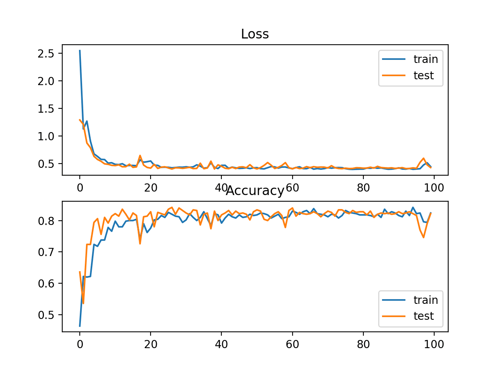

# **Artificial Intelligence in Bioinformatics Project**

## Overview
The visual examination of histopathological images is a cornerstone of cancer diagnosis, requiring pathologists to analyze tissue sections across multiple magnifications to identify tumor cells and subtypes. However, existing attention-based Multiple Instance Learning (MIL) models for Whole Slide Image (WSI) analysis often neglect contextual and numerical features, resulting in limited interpretability and potential misclassifications. Furthermore, the original MIL formulation incorrectly assumes the patches of the same image to be independent, leading to a loss of spatial context as information flows through the network. Incorporating contextual knowledge into predictions is particularly important given the inclination for cancerous cells to form clusters and the presence of spatial indicators for tumors. To address these limitations, we propose an enhanced MIL framework that integrates pre-contextual numerical information derived from semantic segmentation. Specifically, our approach combines visual features with nuclei-level numerical attributes, such as cell density and morphological diversity, extracted using advanced segmentation tools like Cellpose. These enriched features are then fed into a modified BufferMIL model for WSI classification. We evaluate our method on subtyping non-small cell lung cancer (TCGA-NSCLC) and detecting lymph node metastases (CAMELYON16 and CAMELYON17).

## Prerequisites
Before running inference, ensure that:
- The project dependencies are installed (`requirements.txt` or `environment.yml`)
- You have the necessary pretrained weights for feature extraction
- Whole Slide Image (WSI) is placed in the correct input directory (PATH_TO_INPUT_SLIDE)

## Training Process

### Dataset
- Name: Camelyon16/TCGA

### Model
- Architecture: [CellPose / DINO / BufferMIL]
- Pretrained Weights: [Pretrained Checkpoints Used]
- Input size: `[256 x 256]`

### Proposed Architectures

### Hyperparameters
| Parameter      | Value |
|--------------|-------|
| Learning Rate | 0.001 |
| Optimizer    | Adam / SGD |
| Loss Function | BCEWithLogitsLoss |
| Epochs       | 200 |
| Batch Size   | 32 |
| Buffer size  | 10 |
| Buffer rate  | 10 |
| Buffer aggregate | Mean |

### 7. Figures
Include visual results from different stages:
- Sample WSI patches before/after preprocessing
- Feature extraction outputs (e.g., t-SNE visualization)
- Training loss and accuracy curves

## Figures

### 1. Sample Extracted Patches
| Original WSI | Extracted Patches |
|-------------|-----------------|
|  |  |

### 2. CellPose

### 3. Training Loss and Accuracy Curves

## Credits

- Andrea Grandi: [@andrea-grandi](https://github.com/andrea-grandi)
- Daniele Vellani: [@franzione1](https://github.com/franzione1)

